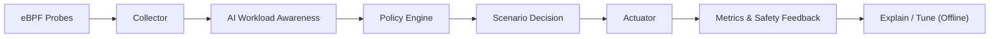

# AegisAI Runtime

基于 eBPF + Rust 的 AI 推理与 Tool Calling 系统级性能优化框架。

## 1. 复查结论

对照 `project.md` 复查后，原骨架的大方向是对的，但还没有完全落到方案真正的设计路线里。

原骨架已经做对的部分：

- 立住了 Observe -> Classify -> Policy -> Actuate -> Evaluate 的闭环
- 明确了项目不是监控平台，而是动态优化引擎
- 收住了第一轮范围，没有一上来把所有高级能力都揉进去

原骨架仍然存在的偏差：

- 更像一个“通用 runtime 平台模板”，三条核心问题还不是一级组织逻辑
- `ai_runtime_classifier` 被放成插件，但“系统感知 AI 任务进程”本质上是基础能力，不应只是附属模块
- benchmark、配置和场景说明没有完全按三条主线拆开

所以这次不是推翻原方案，而是把原方案真正压实成更适合后续实现的骨架。

## 2. 项目定义

### 一句话定义

把 AI workload 当作系统层的一等公民，通过 eBPF 低开销观测、Rust 控制闭环和场景化策略，让 AI 推理与工具调用在真实系统环境中跑得更快、更稳、更低干扰。

### 这个项目不是什么

- 不是另一个通用监控平台
- 不是替代 Linux scheduler
- 不是把 AI 放进微秒级实时调度路径
- 不是第一版就去做 RAG、多智能体、GPU 协同和 dashboard 全家桶

### 这个项目真正要解决什么

- AI 推理线程被抢占，导致 TTFT、P95/P99 延迟和 jitter 恶化
- Tool call 链条中存在冷启动、调度抖动和子链路不稳定
- 系统对 AI 任务感知不足，无法把 AI workload 和 background job 区分对待

## 3. 三条主线

这一版骨架把项目明确收敛为三条主线，它们不是平行散点，而是有依赖关系的。

### 主线 A：AI Workload Awareness

目标：让系统知道“谁是 AI workload、它处于什么阶段、它是否属于交互敏感链路”。

第一轮只做规则识别：

- 进程名
- 命令行特征
- cgroup/tag
- PID allowlist
- 父子进程关系

这是基础层。没有这层，后面的尾延迟保护和工具链优化都会退化成硬编码特判。

### 主线 B：Inference Tail Guard

目标：在 AI 推理关键路径上，针对 run queue delay、off-CPU、迁核、page fault 等干扰信号触发短时、可回退的 boost，降低 TTFT、P95/P99 和 jitter。

这是 MVP 主战场，因为它最容易做出可对比、可量化的系统收益。

### 主线 C：Tool Call Booster

目标：识别工具调用生命周期，在 tool executor、retrieval、rerank、sandbox worker 等子链路上做轻量保护，降低 end-to-end tool call latency。

第一轮不追求复杂 tracing，而是先把“生命周期识别 + 短时 boost + 自动退出”做出来。

## 4. 设计总路线

从问题视角看是三条主线，从实现视角看采用“双轴骨架”。

### 轴一：核心闭环能力轴

- `ebpf/`：低开销观测
- `agent/collector`：事件聚合与窗口统计
- `agent/classifier`：AI workload 识别与阶段标签
- `agent/policy_engine`：规则匹配、动作选择、冲突处理
- `agent/actuator`：系统动作施加与回退
- `agent/metrics`：收益与副作用记录
- `agent/explain_tune`：离线解释、实验报告和调参建议

### 轴二：问题场景轴

- `scenarios/ai_workload_awareness`
- `scenarios/inference_tail_guard`
- `scenarios/tool_call_booster`

场景轴定义“解决什么问题”，能力轴定义“靠什么组件把问题闭环解决”。

## 5. 总体架构



核心数据流：

`kernel event -> event aggregation -> workload label -> scenario policy -> bounded action -> effect measurement`

## 6. 模块职责划分

### `ebpf/`

职责：低开销采集关键系统事件，统一上报到用户态。

第一轮只保留高价值 probe：

- `ebpf_probe`
- `sched_probe`
- `offcpu_probe`
- `fault_probe`
- `io_probe`

### `agent/collector`

职责：聚合 eBPF 事件，形成时间窗口内的高价值特征。

建议负责：

- 窗口统计
- 去噪与采样
- thread/process/cgroup 维度归并
- 对 policy 暴露统一 feature view

### `agent/classifier`

职责：把 process / thread / cgroup 映射为 AI runtime 语义标签。

建议标签：

- `AI_INFERENCE`
- `TOOL_CALL`
- `RETRIEVAL_STAGE`
- `RERANK_STAGE`
- `BACKGROUND_JOB`
- `INTERACTIVE_LATENCY_SENSITIVE`

这层现在被提升为基础能力，不再当成普通插件看待。

### `agent/policy_engine`

职责：把“指标 + 标签 + 安全约束”转换成实际动作决策。

必须包含：

- 触发条件
- 冷却窗口
- 动作强度等级
- 多策略冲突处理
- 最大干预时长
- 安全限制

### `agent/actuator`

职责：执行系统动作，并保证动作有限时、可回退、可审计。

第一轮保守动作：

- CPU affinity
- nice / priority 调整
- cpuset 预留接口
- background throttle 预留接口
- service/cache warmup 预留接口

### `agent/metrics`

职责：记录收益和副作用，而不是只记录“有没有触发过”。

第一轮重点指标：

- TTFT
- P95/P99 latency
- jitter / variance
- boost hit rate
- rollback count

### `scenarios/ai_workload_awareness`

职责：沉淀 AI 任务识别规则、阶段标签和 runtime 适配方案。

### `scenarios/inference_tail_guard`

职责：把尾延迟治理做成可独立推进、可独立验证的场景包。

### `scenarios/tool_call_booster`

职责：把工具链优化做成独立场景包。

## 7. 现在采用的最优骨架

```text
.
├── agent/                          # 用户态控制闭环
│   ├── actuator/
│   ├── classifier/
│   ├── collector/
│   ├── explain_tune/
│   ├── metrics/
│   └── policy_engine/
├── bench/                          # 场景化 benchmark 与干扰实验
│   ├── ai_workload_awareness/
│   ├── inference_tail_guard/
│   ├── interference/
│   ├── scripts/
│   └── tool_call_booster/
├── configs/                        # runtime / classifier / safety / scenario configs
│   ├── classifier/
│   ├── runtime/
│   ├── safety/
│   └── scenarios/
├── docs/                           # 辅助文档
├── ebpf/                           # 内核侧观测能力
│   ├── ebpf_probe/
│   ├── fault_probe/
│   ├── io_probe/
│   ├── offcpu_probe/
│   └── sched_probe/
├── scenarios/                      # 三条主线的场景包
│   ├── ai_workload_awareness/
│   ├── inference_tail_guard/
│   └── tool_call_booster/
├── project.md                      # 原始方案来源
└── README.md                       # 当前总设计入口
```

## 8. MVP 与分阶段规划

### Phase 0：Framework Reset

目标：

- 固定项目定义
- 固定双轴骨架
- 固定安全边界和配置层次

### Phase 1：Awareness Foundation

目标：

- 把 AI workload awareness 做成全局基础能力

交付：

- 统一 label 模型
- classifier config
- 目标 runtime 接入规范

### Phase 2：Inference Tail Guard MVP

目标：

- 证明系统级动态保护可以稳定改善 AI 推理尾延迟

范围：

- `sched/offcpu/fault` 三类 probe
- collector 窗口聚合
- 规则分类
- `inference_tail_guard` 决策
- bounded boost 动作
- benchmark 对照

### Phase 3：Tool Call Booster

目标：

- 降低工具调用链 end-to-end latency

范围：

- tool call 生命周期识别
- executor / retrieval / rerank 子链路标签
- 生命周期内 boost 与自动退出

### Phase 4：AI-aware Isolation

目标：

- 在多任务并发场景下保护交互型 AI workload

### Phase 5：Explain / Tune

目标：

- 生成实验报告、触发解释和参数建议

## 9. 配置设计

这一版把配置也按职责拆开，避免以后所有规则都堆进一个文件里。

### `configs/runtime/`

负责目标环境信息：

- kernel version
- cgroup mode
- reserved cores
- target runtime selection

### `configs/classifier/`

负责 workload 识别规则：

- process name
- cmdline pattern
- stage tag
- parent-child relation

### `configs/scenarios/`

负责各场景独立策略：

- `inference_tail_guard.example.toml`
- `tool_call_booster.example.toml`
- `ai_workload_awareness.example.toml`

### `configs/safety/`

负责全局安全限制：

- 最大优先级提升幅度
- 最大 boost 窗口
- 是否允许 throttle background
- 回退要求

## 10. benchmark 设计

benchmark 不再只围绕一个 `llm_benchmark` 目录，而是明确服务三条主线。

### `bench/inference_tail_guard`

用于验证：

- 无优化 vs 开启 boost
- CPU 干扰场景
- I/O 干扰场景
- TTFT / P95 / P99 / jitter

### `bench/tool_call_booster`

用于验证：

- tool executor 启动延迟
- retrieval / rerank 子链路时延
- 工具链 end-to-end latency

### `bench/ai_workload_awareness`

用于验证：

- 规则识别准确性
- 标签覆盖率
- runtime 适配完整度

### `bench/interference`

用于统一放置干扰源定义：

- `stress-ng`
- `fio`
- background batch workers

## 11. 当前明确不做

- 自动多模型智能分类
- 完整 GPU 协同调度
- 大型 dashboard
- AI 直接参与实时策略执行
- 过强、不可回退的系统控制

## 12. 接下来应该怎么落地

推荐按下面顺序继续推进：

1. 锁定一个 runtime，优先 `ollama` 或 `llama.cpp`
2. 先实现 `AI workload awareness` 的最小规则链路
3. 再打通 `sched/offcpu/fault` 的观测到聚合链路
4. 只做一个最小 `inference_tail_guard` 策略
5. 在 Linux 环境跑出首轮对照实验
6. 再进入 `tool_call_booster`

## 13. 辅助文档

- `docs/architecture.md`：系统分层和骨架说明
- `docs/mvp.md`：MVP 边界与成功标准
- `docs/roadmap.md`：阶段路线
- `docs/experiments.md`：实验与 benchmark 设计
- `docs/resume_pitch.md`：简历与项目表述
