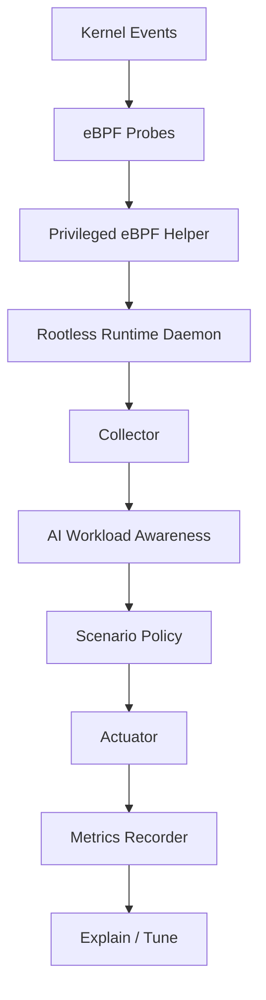

# AegisAI Runtime 架构说明

## 1. 当前架构判断

项目方向没有问题，但骨架需要从“只有分层”升级成“分层 + 场景主线”并存。

因此当前架构采用双轴设计：

- 能力轴：观测、识别、决策、执行、评估
- 场景轴：AI workload 感知、尾延迟保护、工具链调用优化

## 2. 设计目标

系统需要同时满足：

- 低开销观测
- AI workload 可识别
- 干预有限时且可回退
- 策略按场景扩展
- 效果可以被 benchmark 验证

## 3. 非目标

第一轮明确不追求：

- 通用系统监控平台
- 替代 Linux scheduler
- 实时路径中的复杂 AI 决策
- 一次性做完 RAG、多智能体、GPU 协同

## 4. 能力轴

### 4.1 Observe Layer

职责：

- 用窄权限 eBPF helper 低开销采集关键系统干扰信号
- 输出统一事件流
- 尽量限制在目标进程 / cgroup 范围内

第一轮保留：

- `sched_probe`
- `offcpu_probe`
- `fault_probe`
- `io_probe`

### 4.2 Collector Layer

职责：

- 在时间窗口内聚合事件
- 形成 policy 可消费的 feature view
- 做 process / thread / cgroup 维度归并

### 4.3 Classifier Layer

职责：

- 识别 AI workload
- 打阶段标签
- 为场景策略提供路由依据

说明：

这层已经被提升为基础能力，不再视作普通插件。

### 4.4 Policy Layer

职责：

- 把指标与标签转换为策略决策
- 处理冷却时间、优先级、最大干预时长和安全约束

### 4.5 Actuator Layer

职责：

- 执行系统动作
- 保证动作可撤销
- 记录动作生命周期

### 4.6 Metrics / Explain Layer

职责：

- 记录优化前后收益
- 支持离线报告与参数建议

## 5. 场景轴

### 5.1 `ai_workload_awareness`

负责：

- runtime 识别
- 阶段标签
- 交互敏感任务标记
- background job 区分

### 5.2 `inference_tail_guard`

负责：

- 捕捉尾延迟风险信号
- 触发 bounded boost
- 评估 TTFT / P95 / P99 / jitter 改善

### 5.3 `tool_call_booster`

负责：

- 识别 tool call 生命周期
- 跟踪子链路
- 在生命周期内做轻量保护

## 6. 数据流

闭环如下：

1. privileged helper 以固定 probe 集合捕捉关键系统事件
2. rootless runtime daemon 消费 helper 输出的标准事件流
3. collector 聚合窗口内特征
4. classifier 输出 workload label
5. 场景策略消费 label 和 feature
6. actuator 执行带回退边界的动作
7. metrics 评估收益与副作用

## 7. 仓库映射

### `ebpf/`

观测能力入口。

### `agent/`

控制闭环与核心逻辑入口。

`agent/ebpf_helper` 是唯一允许拥有 root 或 eBPF capability 的观测侧辅助组件。
主 daemon 不应以 root 运行，也不应向 helper 传入任意 eBPF/bpftrace 程序。

### `scenarios/`

三条主线的独立场景包入口。

### `bench/`

按场景组织 benchmark 与干扰实验。

### `configs/`

按 runtime / classifier / safety / scenario 拆分配置。

## 8. 部署边界

项目运行目标明确为 Linux：

- Linux kernel 5.15+
- cgroup v2
- 支持 eBPF 的运行环境

默认部署边界：

- `aegisai-runtime-daemon`：普通用户运行
- `aegisai-ebpf-helper`：管理员安装/授权，最小化 root 或 eBPF capability
- 无 helper 或权限不足时：保持 rootless 控制面，降级到 procfs/PSI 等普通权限观测

Windows 或 macOS 适合做文档整理和控制面准备，但 probe 验证和 benchmark 需要在 Linux 主机或 Linux VM 中完成。
