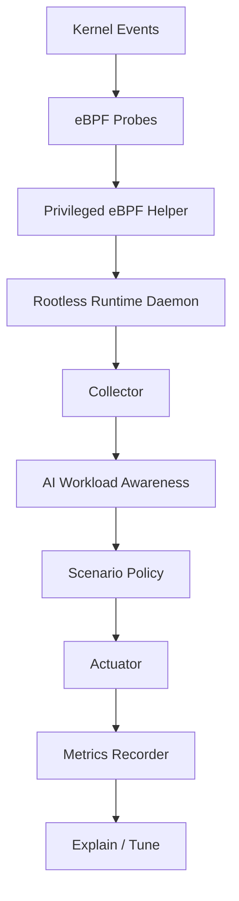

# Architecture And Engineering Boundaries

This file owns durable architecture and process boundaries. Current status lives
in `docs/status.md`; product strategy and roadmap live in `docs/strategy.md`.

## Architecture Shape

AegisAI Runtime uses a dual-axis design:

- capability axis: observe, collect, classify, decide, act, measure
- scenario axis: AI workload awareness, inference tail protection, tool-call
  optimization

Design goals:

- low-overhead observability
- AI workload identification
- bounded and reversible intervention
- scenario-extensible policy
- benchmark-backed effect measurement

Non-goals:

- generic monitoring platform
- Linux scheduler replacement
- complex AI decision-making in realtime scheduler paths
- one-shot implementation of RAG, multi-agent, GPU, dashboard, and adaptive
  policy extensions

## Capability Layers

Observe:

- use a narrow privileged eBPF helper for key interference signals
- emit a normalized event stream
- keep the main daemon rootless
- fall back to procfs/PSI-style signals when helper support is unavailable

Collector:

- aggregate events over policy windows
- form feature views by process, thread, and cgroup

Classifier:

- identify AI workload and stage labels
- provide routing labels for scenario policies
- treat AI workload awareness as foundational capability, not a normal plugin

Policy:

- convert labels and feature views into bounded decisions
- enforce cooldowns, priorities, duration limits, and safety constraints

Actuator:

- execute reversible actions
- record action lifecycle and rollback state
- delegate live CPU affinity planning to `agent/actuator/src/cpu_affinity.rs`

Metrics / Explain:

- record before/after metrics and side effects
- support offline reports and threshold suggestions

## Scenario Lines

`ai_workload_awareness`:

- runtime recognition
- stage labels
- interactive-sensitive markers
- background job distinction

`inference_tail_guard`:

- tail-latency risk detection
- bounded boost decisions
- TTFT, P95/P99, and jitter evaluation

`tool_call_booster`:

- tool call lifecycle recognition
- executor/retrieval/rerank subpath tracking
- lifecycle-scoped scheduler protection

## Data Flow

Closed-loop sequence:

1. privileged helper captures a fixed probe set
2. rootless daemon consumes normalized events
3. collector aggregates window features
4. classifier emits workload labels
5. scenario policy consumes labels and features
6. actuator applies bounded, rollback-capable actions
7. metrics evaluate benefit and side effects

## Repository Map

- `ebpf/`: probe contracts, descriptors, and helper-adjacent observability
- `agent/`: runtime daemon, collector, classifier, policy, actuator, metrics,
  explain/tune, git control
- `agent/ebpf_helper`: the only component intended to carry root or eBPF
  capability
- `scenarios/`: scenario packages for awareness, tail guard, and tool call
  booster
- `bench/`: scenario benchmarks, reports, and host preflights
- `configs/`: runtime, classifier, scenario, and safety config examples

The main daemon should not run as root and should not pass arbitrary
eBPF/bpftrace programs to the helper.

## Deployment Boundary

Target runtime environment:

- Linux kernel `5.15+`
- cgroup v2 or an explicitly understood host layout
- eBPF-capable environment for helper-backed signals

Default split:

- `aegisai-runtime-daemon`: ordinary user process
- `aegisai-ebpf-helper`: administrator-installed helper with minimal root or
  eBPF capability
- degraded path: procfs/PSI-style ordinary-permission observation when helper
  support is unavailable

Windows or macOS are acceptable for docs, control-plane preparation, and mock
verification. Probe validation and benchmark evidence require Linux.

## Live Action Boundaries

Current live affinity boundary:

- `agent/actuator/src/cpu_affinity.rs` parses `Cpus_allowed_list`, reads online
  CPU topology, intersects allowed/online CPUs, selects reserved/low-contention
  targets, and formats rollback targets.
- `linux-command` consumes planner output and executes protected `taskset`
  apply/rollback.
- Empty intersections must remain visible action-effectiveness risks, not fall
  back to offline or disallowed CPUs.

Current Tool Call Booster action boundary:

- benefit proof covers guarded scheduler actions: `nice`, plus explicitly
  enabled `affinity`
- `WarmupExecutor` remains plan/audit-only; current backend records deferred
  apply and no-op rollback, not real executor/cache warmup

## Production Config Boundaries

Current state:

- `RuntimeOrchestratorConfig::load_from_repo_root` reads fixed files under
  `configs/*/*.example.toml` plus `configs/safety/default.toml`.
- Example files are suitable for tests, demos, and benchmark harnesses; they are
  not a production profile contract.

Profile selection rules for future production work:

- select one named profile before reading component config files
- precedence should be CLI flag, then environment variable, then a documented
  non-production local default
- profile names are identifiers, not paths; accept lowercase letters, digits,
  `_`, and `-`; reject path separators, `.` segments, empty names, and absolute
  paths
- production mode must not silently load `*.example.toml`

Schema validation should check TOML syntax, keys/types, required fields, enum
values, numeric ranges, cross-file safety, and host/environment readiness.
Errors should name profile, file, section, key, and violated constraint.

Deferred config work:

- hot reload and dynamic profile switching
- remote config distribution
- secret storage/interpolation
- schema migrations
- dashboard/UI editing
- profile inheritance
- adaptive policy writes back into profile files
- enabling live cpuset writes by profile alone

## Hotspot Refactor Boundaries

Known hotspots:

- `agent/runtime_daemon/src/source.rs`
- `agent/actuator/src/backend.rs`
- `agent/explain_tune/src/engine.rs`
- `agent/runtime_orchestrator/src/runtime_orchestrator.rs`
- `agent/policy_engine/src/engine.rs`
- `bench/scripts/inference_tail_guard_ollama_smoke.sh`

Do not split these as standalone cleanup. A split is acceptable only when it is
attached to active behavior work and covered by targeted verification.

Required boundaries:

- preserve public behavior and CLI/script outputs unless the active issue
  requires a behavior change
- extract one cohesive concern at a time
- avoid combining splitting with broad renames, style cleanup, or unrelated
  moves
- preserve or add targeted tests before claiming behavior preservation
- record the active `bd` issue that justified the split
