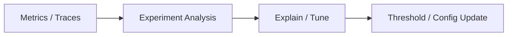

# AegisAI Runtime 技术设计说明书 v2

本说明书用于与当前项目骨架保持一致，定义 AegisAI Runtime 的系统设计总路线、模块边界、场景拆分和阶段交付。本文档对应的是“Framework Reset”后的新方案，而不是旧的插件式目录组织。

## 1. 文档目标

### 1.1 目的

本文档回答四个问题：

- 这个系统到底要解决什么问题。
- 这个系统按什么路线设计和演进。
- 现有骨架中的每一层各自承担什么职责。
- 后续实现时哪些内容先做，哪些内容明确后置。

### 1.2 文档边界

本文档当前不进入具体 Rust 模块接口、eBPF 程序实现细节和内核兼容性细节，而是先固定：

- 设计主线
- 系统边界
- 模块职责
- 数据流
- 配置结构
- benchmark 结构
- 阶段交付

## 2. 系统目标与边界

### 2.1 系统目标

AegisAI Runtime 的目标是构建一个面向 AI inference 与 tool calling 的系统级优化引擎。它基于 eBPF 低开销观测、Rust 用户态控制闭环和场景化策略，对真实系统干扰做出受限、可回退、可审计的优化动作。

系统要实现的核心价值有三类：

- 识别 AI workload，建立系统对 AI 任务的感知能力。
- 在推理关键路径上降低 tail latency 和 jitter。
- 在工具调用关键路径上降低 end-to-end latency。

### 2.2 非目标

本系统当前明确不做：

- 替代 Linux scheduler。
- 构建通用 observability 平台。
- 让 AI 直接进入实时决策闭环。
- 在第一阶段完成 GPU 深度协同调度。
- 在第一阶段进入大规模 RAG、多智能体和集群级编排。

### 2.3 设计原则

- AI workload first-class：AI 任务必须在系统层被识别和区别对待。
- low overhead first：观测必须低开销，优先使用少数高价值指标。
- bounded action first：所有动作必须有限时、可回退、可审计。
- scenario-driven：用场景包定义问题，用能力模块复用闭环。
- Linux-first：当前设计面向 Linux + eBPF 环境。

## 3. 设计总路线

### 3.1 三条主线

#### 主线 A：AI Workload Awareness

系统首先要知道谁是 AI workload，它属于什么阶段，它是否是交互敏感路径。没有这层能力，后续策略只能退化为硬编码特判。

第一轮使用规则识别：

- process name
- cmdline pattern
- cgroup/tag
- PID allowlist
- parent-child relation

#### 主线 B：Inference Tail Guard

系统在 AI 推理关键路径上，根据 run queue delay、off-CPU、迁核、page fault 等信号触发短时 boost，目标是改善：

- TTFT
- P95/P99 latency
- jitter

这条主线是 MVP 主战场。

#### 主线 C：Tool Call Booster

系统识别 tool call 生命周期，并在 tool executor、retrieval、rerank、sandbox worker 等子链路上做轻量保护，目标是降低 tool call end-to-end latency。

### 3.2 主线依赖关系

主线之间存在明确依赖：

`AI Workload Awareness -> Inference Tail Guard -> Tool Call Booster -> AI-aware Isolation / Explain-Tune`

也就是说，任务识别先立住，推理尾延迟先闭环，工具调用优化后进入，最终再扩展到复杂场景。

## 4. 总体架构

### 4.1 双轴架构

系统整体采用“双轴架构”。

#### 能力轴

- `ebpf/`
- `agent/collector`
- `agent/classifier`
- `agent/policy_engine`
- `agent/actuator`
- `agent/metrics`

#### 场景轴

- `scenarios/ai_workload_awareness`
- `scenarios/inference_tail_guard`
- `scenarios/tool_call_booster`

能力轴负责复用闭环，场景轴负责定义问题和策略组合。

### 4.2 在线闭环


### 4.3 离线路径



### 4.4 核心数据流

核心数据流可以描述为：

`kernel event -> event aggregation -> workload label -> policy evaluation -> bounded action -> measurement`

这条链路是系统最基本的闭环。

## 5. 核心抽象

当前设计阶段不固定具体代码接口，但需要固定抽象边界。

### 5.1 Event

`Event` 表示 eBPF 上报到用户态的原始观测事件，至少要包含：

- 时间戳
- pid / tid
- cgroup 或目标分组信息
- probe 来源
- 事件类型
- 时延或计数值

### 5.2 Feature Window

`Feature Window` 表示 collector 在时间窗口内聚合后的高价值特征视图，用于稳定 policy 输入。典型特征包括：

- run queue delay summary
- off-CPU summary
- page fault rate
- CPU migration count
- I/O latency summary

### 5.3 Workload Profile

`Workload Profile` 表示 classifier 对进程、线程、cgroup 的语义判断结果，至少包括：

- workload class
- stage label
- latency sensitivity
- ownership scope

建议标签集合：

- `AI_INFERENCE`
- `TOOL_CALL`
- `RETRIEVAL_STAGE`
- `RERANK_STAGE`
- `BACKGROUND_JOB`
- `INTERACTIVE_LATENCY_SENSITIVE`

### 5.4 Policy Context

`Policy Context` 是 policy engine 的统一输入，由以下部分组成：

- Feature Window
- Workload Profile
- 当前场景配置
- 全局 safety 配置
- 历史 cooldown / boost 状态

### 5.5 Action Plan

`Action Plan` 表示一次被允许执行的动作组合，必须具备：

- 目标对象
- 动作类型
- 强度级别
- 生效时长
- 回退条件
- 审计字段

### 5.6 Metric Record

`Metric Record` 用于记录收益与副作用，至少要覆盖：

- TTFT
- P95/P99 latency
- jitter / variance
- boost hit rate
- rollback count
- side effects

## 6. 模块设计

### 6.1 `ebpf/`

职责是低开销采集高价值内核事件，并统一上报到用户态。

当前保留的 probe 方向：

- `sched_probe`
- `offcpu_probe`
- `fault_probe`
- `io_probe`

设计要求：

- 优先观察与 tail latency 强相关的信号。
- 控制采样范围，尽量面向目标进程或 cgroup。
- 不在第一阶段追求全量 tracing。

### 6.2 `agent/collector`

职责是把原始事件转成稳定、可消费的窗口特征。

核心任务：

- 时间窗口聚合
- 去噪与采样
- thread/process/cgroup 归并
- 输出统一 feature view

collector 不负责做策略判断，也不负责做 workload 语义解释。

### 6.3 `agent/classifier`

职责是把 process/thread/cgroup 映射成 AI runtime 语义。

核心任务：

- 根据规则识别 AI workload
- 输出阶段标签
- 标记交互敏感程度
- 为 policy 提供统一语义标签

这层是基础能力，不作为普通场景包存在。

### 6.4 `agent/policy_engine`

职责是根据“特征 + 标签 + 安全限制”生成动作决策。

最少需要支持：

- trigger condition
- cooldown
- action level
- conflict resolution
- max action window
- safety guardrail

policy engine 只负责做决策，不直接执行系统动作。

### 6.5 `agent/actuator`

职责是执行系统动作，并保证动作可回退、可审计、可自动退出。

第一阶段保守动作包括：

- CPU affinity
- nice / priority 调整
- cpuset 预留接口
- background throttle 预留接口
- service/cache warmup 预留接口

动作要求：

- 默认保守
- 优先用户态可控方案
- 必须有时间边界
- 必须具备 rollback

### 6.6 `agent/metrics`

职责是记录触发、收益和副作用，为 benchmark 与 explain/tune 提供依据。

metrics 关注的不只是“有没有触发过”，还要回答：

- 触发后指标有没有改善
- 动作带来了什么副作用
- 哪类动作最有效

### 6.7 Explain / Tune

Explain / Tune 不进入实时路径，属于离线分析层。

当前职责：

- 生成实验报告
- 解释一次触发为什么发生
- 对阈值和策略参数给出建议

当前不做：

- 实时 AI 决策
- 自动在线学习闭环

## 7. 场景包设计

### 7.1 `scenarios/ai_workload_awareness`

职责：

- 沉淀识别规则
- 维护阶段标签
- 定义目标 runtime 接入方式

当前关注的对象：

- `ollama`
- `llama.cpp`
- `python` inference worker
- `tool-executor`
- `retrieval-worker`
- `rerank-worker`

验证重点：

- 规则识别准确率
- 标签覆盖率
- runtime 适配完整度

### 7.2 `scenarios/inference_tail_guard`

职责：

- 根据推理关键路径上的系统干扰信号触发保护动作
- 改善 AI inference 的 TTFT、P95/P99 和 jitter

输入重点：

- run queue delay
- off-CPU
- migration
- page fault

动作重点：

- bounded boost
- 短时 affinity / priority 调整
- 自动退出

验证重点：

- tail latency 改善幅度
- jitter 改善幅度
- 动作副作用是否可控

### 7.3 `scenarios/tool_call_booster`

职责：

- 识别 tool call 生命周期
- 在工具调用关键子链路上做轻量保护

当前第一轮目标不是复杂 tracing，而是：

- tool call start/end 识别
- executor / retrieval / rerank 标签
- 生命周期内 boost
- 自动退出

验证重点：

- tool call end-to-end latency
- 子链路波动
- 冷启动抖动

### 7.4 后续扩展场景

后续可以扩展但当前不进入实现的场景：

- AI-aware isolation
- RAG pipeline booster
- multi-agent runtime isolation
- cold start optimizer

## 8. 配置设计

配置按职责分层，避免把所有规则堆进单一文件。

### 8.1 `configs/runtime/`

负责描述目标环境：

- kernel version
- cgroup mode
- reserved cores
- target runtime selection

### 8.2 `configs/classifier/`

负责 workload 识别规则：

- process name
- cmdline pattern
- stage tag
- parent-child relation

### 8.3 `configs/scenarios/`

负责场景独立策略：

- `ai_workload_awareness.example.toml`
- `inference_tail_guard.example.toml`
- `tool_call_booster.example.toml`

### 8.4 `configs/safety/`

负责全局安全限制：

- 最大优先级提升幅度
- 最大 boost 窗口
- 是否允许 throttle background
- rollback 要求

## 9. Benchmark 设计

benchmark 结构必须服务三条主线，而不是继续围绕旧的单一 benchmark 目录组织。

### 9.1 `bench/ai_workload_awareness`

验证：

- 规则识别准确性
- 标签覆盖率
- 识别误报/漏报情况

### 9.2 `bench/inference_tail_guard`

验证：

- 无优化 vs 开启 boost
- CPU 干扰场景
- I/O 干扰场景
- TTFT / P95 / P99 / jitter

### 9.3 `bench/tool_call_booster`

验证：

- tool executor 启动延迟
- retrieval / rerank 时延
- tool call end-to-end latency

### 9.4 `bench/interference`

统一管理干扰源：

- `stress-ng`
- `fio`
- background batch workers

## 10. 阶段交付

### Phase 0：Framework Reset

目标：

- 固定项目定义
- 固定双轴骨架
- 固定配置边界
- 固定文档路线

### Phase 1：Awareness Foundation

交付：

- 统一 label 模型
- classifier 规则配置
- 目标 runtime 适配规范

### Phase 2：Inference Tail Guard MVP

交付：

- `sched/offcpu/fault` 观测
- collector 聚合
- classifier 标签
- tail guard 决策
- bounded boost 动作
- benchmark 对照

### Phase 3：Tool Call Booster

交付：

- tool call 生命周期识别
- 子链路标签
- 生命周期内 boost
- 自动退出

### Phase 4：AI-aware Isolation

交付目标：

- 在多任务并发场景下保护交互型 AI workload

### Phase 5：Explain / Tune

交付目标：

- 生成实验报告
- 解释触发原因
- 提供参数建议

## 11. 风险与设计决策

### 11.1 风险：过度干预

问题：

- 过强 boost 可能影响系统整体公平性。

决策：

- 所有动作必须 bounded。
- 必须设置 cooldown 和 rollback。
- 第一阶段默认保守动作。

### 11.2 风险：误识别或漏识别 AI workload

问题：

- classifier 质量决定后续策略有效性。

决策：

- 第一阶段先做规则识别，不追求复杂智能分类。
- 优先可解释、可调试的识别路径。

### 11.3 风险：观测面过大导致失控

问题：

- probe 过多会带来额外开销和复杂度。

决策：

- 第一阶段仅保留高价值 probe。
- 先围绕 tail latency 强相关信号构建闭环。

### 11.4 风险：系统被误解为“监控平台”

问题：

- 如果只强调观测，项目价值会被削弱。

决策：

- 文档和工程结构统一强调“优化闭环”而不是“指标采集”。
- benchmark 重点展示干预收益，而不是只展示监控数据。

## 12. 工程结构映射

```text
.
├── agent/
│   ├── actuator/
│   ├── classifier/
│   ├── collector/
│   ├── metrics/
│   └── policy_engine/
├── bench/
│   ├── ai_workload_awareness/
│   ├── inference_tail_guard/
│   ├── interference/
│   ├── scripts/
│   └── tool_call_booster/
├── configs/
│   ├── classifier/
│   ├── runtime/
│   ├── safety/
│   └── scenarios/
├── docs/
├── ebpf/
│   ├── fault_probe/
│   ├── io_probe/
│   ├── offcpu_probe/
│   └── sched_probe/
├── scenarios/
│   ├── ai_workload_awareness/
│   ├── inference_tail_guard/
│   └── tool_call_booster/
├── project.md
├── specification.md
└── README.md
```

说明：

- `project.md` 是总方案总纲。
- `specification.md` 是技术设计说明书。
- `README.md` 是当前项目的总设计入口。

## 13. 当前不进入的细化设计

为了先把总路线定稳，以下内容明确放到后续真正动工阶段再细化：

- Rust crate/workspace 组织方式
- 具体 eBPF 程序接口
- probe 到用户态的数据结构实现
- policy rule DSL 细节
- actuator 的系统调用封装
- benchmark 自动化脚本实现

## 14. 当前设计结论

当前版本的最终结论是：

先把 `AI Workload Awareness` 做成基础能力，再围绕 `Inference Tail Guard` 打出第一个系统级优化闭环，随后将同一套能力复用到 `Tool Call Booster`。整个工程采用“能力轴 + 场景轴”的双轴设计，而不再回到旧的插件式组织方式。
